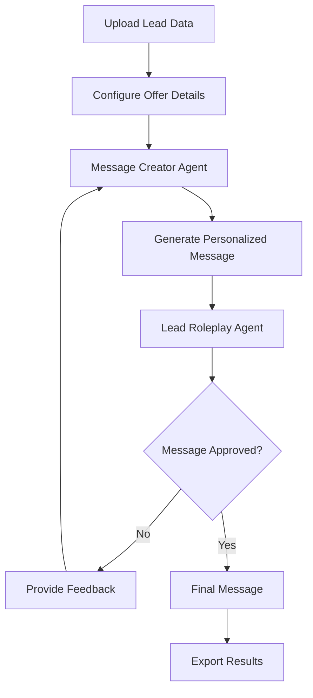

# DataVibe Sheet 🚀

> A lightweight, powerful alternative to Clay.com for data enrichment and automation workflows

[](https://reactjs.org/)
[](https://www.typescriptlang.org/)
[](https://nextjs.org/)
[](https://pptr.dev/)
[](https://opensource.org/)
[]()
[](https://opensource.org/licenses/MIT)

## 🎯 Overview

Bricks Sheet is a sophisticated data enrichment platform built as a **fully local, open-source** alternative to Clay.com. It combines the power of AI, web scraping, and browser automation to transform raw CSV data into actionable business intelligence.

**Why Bricks Sheet?** Clay.com's pricing can be prohibitive for many users. This project delivers enterprise-grade data enrichment capabilities at zero recurring cost, with support for both cloud and local AI models. **Everything runs on your machine** - your data never leaves your control.

✨ **100% Open Source** • 🏠 **Fully Local Processing** • 🔒 **Complete Privacy** • 💰 **Zero Recurring Costs**

also a brick is stronger than clay

## ✨ Core Features

### 🧠 Built-In AI Integration
- **OpenAI Integration**: Full support for GPT models configurable parameters
- **Local Ollama Support**: Run models like Llama2, Mistral, CodeLlama locally without API costs
- **Reasoning Models**: Support for DeepSeek R1, o1-preview with thinking mode capabilities
- **Smart Provider Switching**: Seamlessly switch between cloud and local AI providers

### 🤖 AI Copy Agents System
A revolutionary dual-agent system for automated personalized outreach:
- **Message Creator Agent**: Generates personalized DM messages using lead data and offer details
- **Lead Roleplay Agent**: Acts as the prospect, provides structured feedback and approval decisions
- **Iterative Refinement**: Agents collaborate through multiple iterations until approval
- **Custom Instructions**: Fine-tune both agents with specific business requirements
- **Multi-Model Support**: Mix and match OpenAI and Ollama models for optimal cost/performance

### 🌐 Advanced Web Scraping
- **Firecrawl Integration**: Professional-grade web scraping with LLM-ready markdown output
- **Dynamic URL Templates**: Use CSV column data to build dynamic URLs for batch scraping
- **Rate Limiting**: Built-in respectful scraping with configurable delays
- **Error Handling**: Robust error handling for failed requests and malformed data

### 🎭 Puppeteer Automation Engine
Full browser automation with enterprise-grade features:
- **Queue-Based Processing**: Handle thousands of automation tasks with intelligent queueing
- **Browser Pool Management**: Efficient browser reuse with memory management
- **Anti-Ban Technology**: 
  - User agent rotation
  - Request timing randomization
  - Session management
  - Stealth plugin integration
- **Real-time Logging**: Live execution logs with detailed debugging information
- **Concurrent Processing**: Multiple browser instances with configurable concurrency limits

### 📊 Smart Data Processing
- **CSV Import/Export**: Drag-and-drop CSV handling with validation
- **Formula Engine**: JavaScript-based formula system for data transformation
- **Column-Based Operations**: Apply different enrichment strategies per column
- **Real-time Validation**: Live formula validation with syntax highlighting
- **Data Preview**: Real-time preview with actual data before execution

### 🎨 Modern User Experience
- **Responsive Design**: Built with Tailwind CSS and shadcn/ui components
- **Dark/Light Mode**: Automatic theme switching with system preference detection
- **Intuitive Interface**: Clean, professional interface inspired by modern SaaS tools
- **Real-time Feedback**: Toast notifications and progress indicators
- **Keyboard Shortcuts**: Power-user features with keyboard navigation

### 🏠 Fully Local & Open Source
- **Complete Privacy**: All data processing happens on your machine
- **No Vendor Lock-in**: Open source MIT license - modify as needed
- **Offline Capable**: Works without internet (with local AI models)
- **Self-Hosted**: Run on your own infrastructure
- **Transparent**: Full source code available for audit and customization
- **Community Driven**: Contribute features and improvements

## 🏗️ Technical Architecture

### Frontend Stack
- **React 18.3.1** with TypeScript for type-safe development
- **Vite** for lightning-fast development and optimized builds
- **Zustand** for lightweight, efficient state management
- **Tailwind CSS + shadcn/ui** for consistent, accessible design system
- **React Query** for intelligent API state management

### Backend Stack
- **Next.js 15.5.4** API routes for serverless scalability
- **Puppeteer 22.0.0** with stealth plugins for undetectable automation
- **Queue System** with intelligent job scheduling and concurrency control
- **Browser Pool Manager** for resource optimization and memory management

### AI & ML Integration
- **OpenAI API** integration with support for latest models including GPT-4o
- **Ollama** local model support for cost-effective AI operations
- **Structured Output** parsing with JSON mode for reliable agent communication
- **Thinking Mode** support for reasoning models like DeepSeek R1

## 🚀 Quick Start

### Prerequisites
- Node.js 18+ and npm/yarn
- For Ollama support: [Ollama](https://ollama.ai/) installed locally
- For Puppeteer: Chrome/Chromium browser

### Installation

```bash
# Clone the repository
git clone https://github.com/yourusername/bricks.git
cd bricks

# Install dependencies
npm install

# Install backend dependencies
cd api/bricks-api
npm install
cd ../..

# Start development servers
npm run dev              # Frontend (port 5173)
npm run dev:api          # Backend API (port 3000)
```

### Configuration

1. **Set up AI providers:**
   - Click "API Keys" button in the interface
   - Add your OpenAI API key for cloud models
   - Or install Ollama locally: `ollama pull llama2`

2. **Configure Firecrawl (optional):**
   - Get API key from [Firecrawl.dev](https://firecrawl.dev)
   - Add to AI Configuration panel

3. **Start enriching data:**
   - Upload a CSV file
   - Choose your enrichment mode (AI, Scraping, or Automation)
   - Configure and execute!

## 📖 Feature Deep Dive

### AI Copy Agents Workflow



**Example Configuration:**
- **Your Offer**: "AI-powered lead generation tool that increases conversion rates by 40%"
- **Message Creator**: GPT-4o with custom instructions for your industry
- **Lead Roleplay**: Local Llama2 model acting as prospects in your target market
- **Result**: Personalized, pre-approved messages ready for outreach

### Puppeteer Automation Examples

```javascript
// Example 1: Extract LinkedIn profile data
await page.goto(`https://linkedin.com/in/{Username}`);
await page.waitForSelector('h1');
const name = await page.$eval('h1', el => el.textContent);
const headline = await page.$eval('.text-body-medium', el => el.textContent);
return `${name} - ${headline}`;

// Example 2: Company information lookup
await page.goto(`https://example.com/search?q={Company}`);
const results = await page.$$eval('.result', els => 
  els.map(el => el.textContent).join(', ')
);
return results;

// Example 3: Screenshot capture
await page.goto('{Website}');
await page.setViewport({ width: 1200, height: 800 });
const screenshot = await page.screenshot({ encoding: 'base64' });
return `data:image/png;base64,${screenshot}`;
```

### Formula Engine Examples

```javascript
// Example 1: Email validation and categorization
const email = row['Email'];
if (!email) return 'No email';
if (email.includes('@gmail.com')) return 'Gmail User';
if (email.includes('@company.com')) return 'Corporate Email';
return 'Other Provider';

// Example 2: Lead scoring algorithm
const company = row['Company'] || '';
const title = row['Title'] || '';
let score = 0;
if (title.toLowerCase().includes('ceo')) score += 10;
if (title.toLowerCase().includes('director')) score += 7;
if (company.length > 10) score += 5;
return `Score: ${score}/20`;

// Example 3: Data cleaning and standardization
const phone = row['Phone'] || '';
const cleaned = phone.replace(/[^0-9]/g, '');
if (cleaned.length === 10) {
  return `(${cleaned.slice(0,3)}) ${cleaned.slice(3,6)}-${cleaned.slice(6)}`;
}
return 'Invalid phone';
```

## 🎯 Business Use Cases

### 1. **Lead Enrichment Pipeline**
- Upload list of company names
- Use Firecrawl to scrape company websites
- Apply AI to extract key information (industry, size, tech stack)
- Generate personalized outreach messages
- Export enriched data with contact strategies

### 2. **Social Media Research**
- Input list of LinkedIn profiles
- Use Puppeteer to extract profile data
- Apply AI to analyze and categorize prospects
- Generate personalized connection messages
- Track and optimize outreach performance

### 3. **Market Research Automation**
- Upload competitor URLs
- Scrape pricing, features, and positioning
- Use AI to analyze competitive landscape
- Generate strategic insights and recommendations
- Create comprehensive market analysis reports

### 4. **Content Personalization**
- Upload customer data (industry, role, company size)
- Use AI agents to generate personalized email campaigns
- A/B test different message variants
- Optimize messaging based on response rates
- Scale personalized outreach across thousands of prospects

## 🔧 Advanced Configuration

### Environment Variables
```bash
# API Configuration
OPENAI_API_KEY=your_openai_key_here
FIRECRAWL_API_KEY=your_firecrawl_key_here

# Puppeteer Settings
PUPPETEER_MAX_CONCURRENT=3
PUPPETEER_DEFAULT_TIMEOUT=30000
PUPPETEER_RATE_LIMIT_DELAY=2000

# Ollama Configuration
OLLAMA_BASE_URL=http://localhost:11434
```

### Performance Tuning

**For Large Datasets (10,000+ rows):**
- Increase Puppeteer concurrency: `PUPPETEER_MAX_CONCURRENT=5`
- Use local Ollama models to avoid API rate limits
- Implement batch processing with queue prioritization
- Consider running on cloud instances with more RAM

**For Cost Optimization:**
- Use GPT-3.5-turbo for simple tasks, GPT-4 for complex reasoning
- Mix OpenAI and Ollama models based on task complexity
- Implement result caching for repeated queries
- Use Firecrawl for structured data, Puppeteer for complex interactions

## 🛠️ Development

### Project Structure
```
bricks/
├── src/                          # Frontend React application
│   ├── components/              # Reusable UI components
│   │   ├── FormulaEditor.tsx   # Main formula editing interface
│   │   ├── AIConfiguration.tsx # AI settings and provider management
│   │   └── ui/                 # shadcn/ui component library
│   ├── lib/                    # Utility libraries
│   │   ├── aiAgents.ts        # AI Copy Agents implementation
│   │   ├── ollama.ts          # Ollama integration utilities
│   │   └── utils.ts           # General utilities
│   └── stores/                # Zustand state management
│       └── useDataStore.ts    # Main data state management
├── api/bricks-api/             # Next.js backend API
│   ├── app/api/               # API route handlers
│   │   └── puppeteer/         # Puppeteer automation endpoints
│   └── tests/                 # API integration tests
├── docs/                      # Technical documentation
└── public/                    # Static assets
```

### Testing Strategy
```bash
# Run frontend tests
npm test

# Run backend API tests
cd api/bricks-api
npm test

# Run Puppeteer integration tests
node tests/test-puppeteer.js

# Run AI agents test
node tests/test-ai-agents.js
```

### Contributing Guidelines
1. Fork the repository
2. Create feature branch: `git checkout -b feature/amazing-feature`
3. Commit changes: `git commit -m 'Add amazing feature'`
4. Push to branch: `git push origin feature/amazing-feature`
5. Open a Pull Request

## 📊 Performance Benchmarks

| Operation | Clay.com | Bricks Sheet | Savings |
|-----------|----------|----------------|----------|
| 1000 AI enrichments | $50-100 | $2-10* | 80-95% |
| Web scraping (1000 pages) | $20-40 | $0-5** | 75-100% |
| Browser automation | $30-60 | $0*** | 100% |
| Monthly platform fee | $349+ | $0 | 100% |

*Using OpenAI API directly  
**Using Firecrawl API or free scraping  
***Self-hosted Puppeteer

## 🔒 Security & Privacy

- **100% Local Processing**: All data stays on your machine - never uploaded anywhere
- **Open Source Transparency**: Full source code available for security audits
- **No Telemetry**: Zero data collection or tracking
- **API Key Security**: Keys stored locally, never transmitted to our servers
- **Sandboxed Execution**: Formula execution in controlled environments
- **Self-Hosted**: Complete control over your infrastructure and data
- **GDPR Compliant**: Local processing ensures automatic compliance
- **Stealth Mode**: Undetectable browser automation to respect target sites

## 🚀 Deployment Options

### Local Development
```bash
npm run dev
```

### Production Build
```bash
npm run build
npm run preview
```

### Docker Deployment
```bash
docker build -t bricks .
docker run -p 3000:3000 -p 5173:5173 bricks
```

### Cloud Deployment
- **Vercel**: One-click deployment for frontend
- **Railway**: Full-stack deployment with database
- **AWS/GCP**: Enterprise deployment with auto-scaling

## 🎓 Learning Resources

- [AI Copy Agents Guide](docs/ai-copy-agents.md)
- [Puppeteer Automation Tutorial](docs/puppeteer-mode-user-guide.md)
- [Formula Engine Documentation](docs/formula-engine.md)
- [Troubleshooting Guide](docs/puppeteer-troubleshooting.md)

## 🤝 Community & Support

- **Issues**: [GitHub Issues](https://github.com/yourusername/bricks/issues)
- **Discussions**: [GitHub Discussions](https://github.com/yourusername/bricks/discussions)
- **Documentation**: [Wiki](https://github.com/yourusername/bricks/wiki)

## 📈 Roadmap

### Q1 2025
- [ ] Advanced AI agent templates (sales, marketing, research)
- [ ] Integration with popular CRMs (HubSpot, Salesforce)
- [ ] Advanced data visualization and analytics
- [ ] Team collaboration features

### Q2 2025
- [ ] API marketplace for custom integrations
- [ ] Advanced workflow automation
- [ ] Mobile-responsive interface
- [ ] Enterprise SSO integration

## 📄 License

This project is licensed under the MIT License - see the [LICENSE](LICENSE) file for details.

## 🙏 Acknowledgments

- **OpenAI** for providing cutting-edge language models
- **Ollama** for making local AI accessible
- **Puppeteer Team** for robust browser automation
- **Vercel** for Next.js and deployment platform
- **shadcn/ui** for beautiful, accessible components

---

**Built with ❤️ to democratize data enrichment and make powerful automation accessible to everyone.**

🏠 **Fully Local** • 🔓 **100% Open Source** • 🔒 **Privacy First** • 💰 **Forever Free**

*Bricks Sheet - Where your data comes alive, and stays yours* 🚀